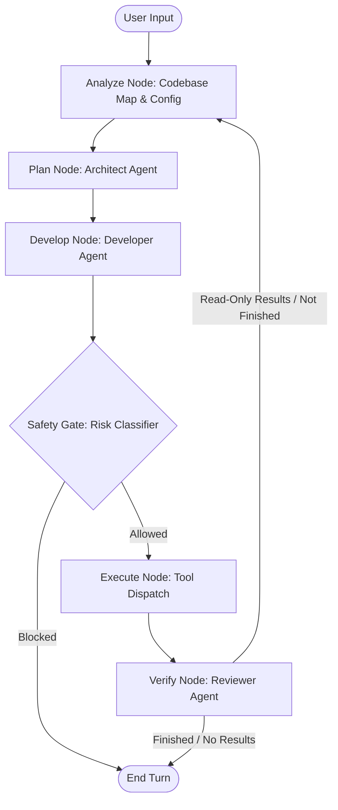

# ⚡ 999-CLI: Autonomous Agentic IDE Manager

999-CLI is a powerful, autonomous software engineering suite designed to transform local development. It uses a reasoning-based orchestrator powered by **Local LLMs** (via LM Studio) to plan, execute, and verify complex engineering tasks directly in your workspace.

---

## 🚀 Key Features

### 🧠 The Reasoning Brain
- **Cyclic Orchestrator**: Built on LangGraph, the system follows a robust "Analyze-Plan-Execute-Verify" loop.
- **Autonomous Continuity**: Can chain multiple tool calls, navigate deep directory structures, and manage long-running tasks without constant user prompting.
- **Context Aware**: Automatically indexes your workspace and respects project-specific conventions via `.999/config.md`.

### 🛡️ Safety & Governance
- **Ethics Layer**: Every plan is audited by a specialized **Risk Classifier** before execution.
- **Human-in-the-Loop (HITL)**: High-risk actions (score > 0.7) are automatically blocked or held for manual approval.
- **Local Sandbox**: Terminal commands are strictly scoped to the workspace directory to prevent system-wide side effects.
- **Git Checkpoints**: Automatically stashes changes before complex file operations, allowing for instant `/undo`.

### 🛠️ Integrated Toolset
- **File Manager**: Precise reading, writing, patching (diff-based), and searching. Supports **PDF, Word (.docx), Excel (.xlsx), and CSV**. Now includes **Smart Truncation** (300-line budget) for code files to prevent context window overflow.
- **Terminal**: Execute build commands, install dependencies, and run scripts.
- **Git Integration**: Full control over status, diffs, commits, and branch management.
- **Browser & Web**: Fetch documentation or browse local dev servers for verification.
- **Advanced RAG Engine**: Hybrid search combining vector and keyword retrieval for deep architectural understanding.

### 🆕 Advanced Intelligence Layers 
- **Hybrid Search (FAISS + BM25)**: Combines semantic understanding with keyword precision using Reciprocal Rank Fusion (RRF).
- **AST-Aware Chunking**: Python files are chunked respecting function and class boundaries, preserving docstrings and decorators.
- **File-Level Summaries**: Generates synthetic summaries for every file, enabling the system to answer file-wide queries.
- **Dependency Graph Mapping**: New `dependency_graph` tool to map local Python imports and understand module relationships.
- **Incremental Indexing**: Only re-indexes files that have changed, saving massive amounts of time.
- **Staleness Auto-Heal**: Automatically detects when files are modified and updates the index in the background.
- **Symbol Intelligence**: AST-based extraction of functions, classes, and methods for instant codebase mapping.
- **Vision & OCR Intelligence**: Ability to "read" images and extract text from visuals inside PDFs and Word documents (requires Tesseract OCR).

### 🛠️ System Hardening & Robustness (Recent Updates)
- **🌀 Concurrent Parallel Subagent Swarms**: Spawns multiple specialized subagents concurrently in background worker threads (via `ThreadPoolExecutor`) and displays a live, animated terminal progress dashboard (via `rich.live.Live` and `rich.spinner.Spinner`) that dynamically transitions to success/error checkmarks as tasks complete.
- **✨ Surgical Thought Suppression & Visual Polish**: Overhauled the live token console stream to completely suppress raw intent tags (`[INTENT: ...]`), internal reasoning (`THINK:` blocks), and system headers, unmuting only when the final answer (`RESPONSE:`) or action plan (`PLAN:`) is reached. Upgraded final panels to display strictly the markdown response, keeping the workspace highly polished and professional.
- **🛡️ Resilient Memory Store Loading**: Shielded module-level imports of FAISS and SentenceTransformers inside `EpisodeStore` with lazy loading and exception boundaries, protecting CLI startup from host-level virtual memory/paging exhaustion crashes.
- **📐 Conversational Synthesis Loop**: Corrected the core orchestrator routing inside `should_continue` to loop successful tool runs (e.g., audits, scans, file creations) back to `analyze/plan` nodes. This gives the Architect the chance to read execution results and generate a polished final conversational report before ending.
- **🚀 Premature Termination Routing Guard**: Resolved edge conditions where the Architect prematurely printed `"FINISHED"` on `CODE_CHANGE` tasks, forcing the system to route strictly to the `develop` Specialist Swarms for all code modifications.
- **Intelligent Tool Argument Parsing**: Hardened the tool parser to handle alternative argument names hallucinated by smaller models (e.g., mapping `file_path`, `filepath`, and `arg` to `path`).
- **Read-Only Loop Priority**: Fixed a critical bug where premature `FINISHED` flags bypassed data retrieval. The system now strictly forces a loop-back to the Architect after retrieving read-only data, ensuring complete answers are generated.
- **Smart Symbol Chunking**: Improved the reading of large codebases by instructing the Architect to use `extract_symbols` and `view_file_lines` for large files instead of full-file reads, preventing context window truncation.
- **UI Truncation Transparency**: Updated the CLI interface to explicitly warn users when tool outputs are truncated for display purposes, clarifying that the underlying agent still received the complete data.
- **Robust Read-Only Fallbacks**: Handled edge cases where the model decides "No action is needed", ensuring the Reviewer scores the interaction correctly and prevents infinite loops.
- **True Autonomy Unlocked**: Fixed a core routing bug where the loop ended unconditionally after one step if successful. Now, the system defaults to looping back to the Architect until it explicitly declares 'FINISHED', enabling autonomous chaining of multi-step operations.

### 🏥 Auto-Heal & Auto-Test
- **Auto-Test**: Automatically detects and runs `pytest`, `npm test`, or `go test` after modifications.
- **Auto-Heal**: Monitors local development servers (e.g., `localhost:3000`) for build errors or crashes and attempts to fix them immediately.


---

## 🏗️ Architecture

The system uses a **Multi-Agent Swarm** approach to divide and conquer tasks:
- **Architect Agent** (`plan_node`): Analyzes the codebase and formulates a high-level plan.
- **Developer Agent** (`develop_node`): Translates the plan into specific tool calls or code edits.
- **Reviewer Agent** (`verify_node`): Evaluates the execution results, runs tests, and scores the success to determine if the loop should continue.



---

## 🏁 Getting Started

### 1. Prerequisites
- **Python 3.10+**
- **LM Studio**: Running the `gemma-4-e4b` model (or compatible) on `http://localhost:1234/v1`.
- **Tesseract OCR**: Required for image reading and OCR (install from [UB-Mannheim](https://github.com/UB-Mannheim/tesseract/wiki)).

### 2. Installation
Clone the repository and install in editable mode:
```bash
git clone https://github.com/your-repo/999-cli.git
cd 999-cli
pip install -e .
```

### 3. Usage
Start the CLI from any project directory:
```bash
999
```

**CLI Flags:**
- `--yolo`: Auto-approve all file writes and terminal commands (use with caution!).
- `--safe`: Require manual approval for **all** actions, including read operations.

---

## ⌨️ Slash Commands

| Command | Description |
| :--- | :--- |
| `/help` | Show available commands and usage info. |
| `/status` | Display current Git status. |
| `/diff` | Show pending Git changes. |
| `/undo` | Revert the last set of changes (via git stash pop). |
| `/config` | Initialize project-specific configuration (`.999/config.md`). |
| `/model` | Switch between models available on your local server. |
| `/mode` | Toggle between `yolo`, `safe`, and `default` modes. |
| `/speed` | Toggle between `fast` and `deep` analysis modes. |
| `/compact` | Summarize long chat histories to save tokens. |
| `/stop` | Kill all background processes (dev servers). |
| `/tokens` | View token usage and inference stats for the session. |
| `/clear` | Reset the current session history. |

---

## ⚙️ Configuration

You can customize the agent's behavior by creating a `.999/config.md` file in your project root (run `/config` to generate a template). Use this to specify:
- **Coding Style**: Indentation, naming conventions, docstring requirements.
- **Project Context**: Architecture notes, critical files, or API endpoints.
- **Workflow**: Preferred test commands or build scripts.

---

## 🔒 Security Information

The **999-CLI** is designed with a "Security First" mindset:
1. **No External Exfiltration**: The system does not send your code to external APIs unless you explicitly configure a remote provider.
2. **Command Sanitization**: Potentially destructive commands (like `rm -rf /`) are hard-blocked at the tool level.
3. **Audit Logs**: All tool executions and risk assessments are logged for transparency.
