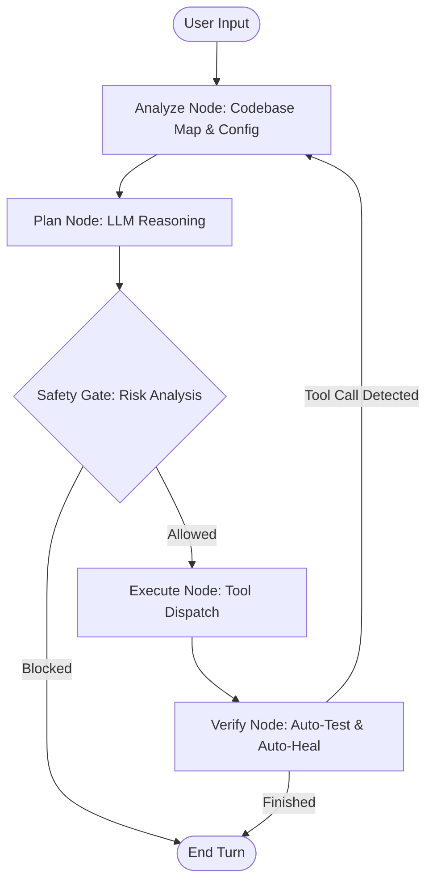

# ⚡ 999-CLI: Autonomous Agentic IDE Manager

999-CLI is a powerful, autonomous software engineering suite designed to transform local development. It uses a reasoning-based orchestrator powered by **Local LLMs** (via LM Studio) to plan, execute, and verify complex engineering tasks directly in your workspace.

---

## 🚀 Key Features

### 🧠 The Reasoning Brain
- **Cyclic Orchestrator**: Built on LangGraph, the system follows a robust "Analyze-Plan-Execute-Verify" loop.
- **Autonomous Continuity**: Can chain multiple tool calls, navigate deep directory structures, and manage long-running tasks without constant user prompting.
- **Context Aware**: Automatically indexes your workspace and respects project-specific conventions via `.999/config.md`.

### 🛡️ Safety & Governance
- **Ethics Layer**: Every plan is audited by a specialized **Risk Classifier** before execution.
- **Human-in-the-Loop (HITL)**: High-risk actions (score > 0.7) are automatically blocked or held for manual approval.
- **Local Sandbox**: Terminal commands are strictly scoped to the workspace directory to prevent system-wide side effects.
- **Git Checkpoints**: Automatically stashes changes before complex file operations, allowing for instant `/undo`.

### 🛠️ Integrated Toolset
- **File Manager**: Precise reading, writing, patching (diff-based), and searching. Now supports **PDF, Word (.docx), Excel (.xlsx), and CSV**.
- **Terminal**: Execute build commands, install dependencies, and run scripts.
- **Git Integration**: Full control over status, diffs, commits, and branch management.
- **Browser & Web**: Fetch documentation or browse local dev servers for verification.
- **RAG Engine**: Semantic search and workspace indexing with **smart chunking** for deep architectural understanding.

### 🆕 Advanced Intelligence Layers
- **Symbol Intelligence**: AST-based extraction of functions, classes, and methods for instant codebase mapping.
- **Vision & OCR Intelligence**: Ability to "read" images and extract text from visuals inside PDFs and Word documents (requires Tesseract OCR).
- **Performance Caching**: Intelligent codebase mapping cache to maintain high speed in massive enterprise repositories.
- **Automated Synthesis**: New `get_codebase_summary` tool for instant project-level insights and architectural overviews.

### 🏥 Auto-Heal & Auto-Test
- **Auto-Test**: Automatically detects and runs `pytest`, `npm test`, or `go test` after modifications.
- **Auto-Heal**: Monitors local development servers (e.g., `localhost:3000`) for build errors or crashes and attempts to fix them immediately.

---

## 🏗️ Architecture



---

## 🏁 Getting Started

### 1. Prerequisites
- **Python 3.10+**
- **LM Studio**: Running the `gemma-4-e4b` model (or compatible) on `http://localhost:1234/v1`.
- **Tesseract OCR**: Required for image reading and OCR (install from [UB-Mannheim](https://github.com/UB-Mannheim/tesseract/wiki)).

### 2. Installation
Clone the repository and install in editable mode:
```bash
git clone https://github.com/your-repo/999-cli.git
cd 999-cli
pip install -e .
```

### 3. Usage
Start the CLI from any project directory:
```bash
999
```

**CLI Flags:**
- `--yolo`: Auto-approve all file writes and terminal commands (use with caution!).
- `--safe`: Require manual approval for **all** actions, including read operations.

---

## ⌨️ Slash Commands

| Command | Description |
| :--- | :--- |
| `/help` | Show available commands and usage info. |
| `/status` | Display current Git status. |
| `/diff` | Show pending Git changes. |
| `/undo` | Revert the last set of changes (via git stash pop). |
| `/config` | Initialize project-specific configuration (`.999/config.md`). |
| `/model` | Switch between models available on your local server. |
| `/mode` | Toggle between `yolo`, `safe`, and `default` modes. |
| `/compact` | Summarize long chat histories to save tokens. |
| `/stop` | Kill all background processes (dev servers). |
| `/tokens` | View token usage and inference stats for the session. |
| `/clear` | Reset the current session history. |

---

## ⚙️ Configuration

You can customize the agent's behavior by creating a `.999/config.md` file in your project root (run `/config` to generate a template). Use this to specify:
- **Coding Style**: Indentation, naming conventions, docstring requirements.
- **Project Context**: Architecture notes, critical files, or API endpoints.
- **Workflow**: Preferred test commands or build scripts.

---

## 🔒 Security Information

The **999-CLI** is designed with a "Security First" mindset:
1. **No External Exfiltration**: The system does not send your code to external APIs unless you explicitly configure a remote provider.
2. **Command Sanitization**: Potentially destructive commands (like `rm -rf /`) are hard-blocked at the tool level.
3. **Audit Logs**: All tool executions and risk assessments are logged for transparency.
